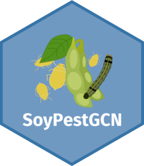

<!-- README.md is generated from README.Rmd. Please edit that file -->

# SoyInsectGCN 

<!-- badges: start -->

[](https://lifecycle.r-lib.org/articles/stages.html#experimental)
<!-- badges: end -->

SoyInsectGCN is an R package that contains a Shiny app to let users
explore a gene coexpression network of soybean tissues infested with
insects.

## Installation

You can install the released version of SoyInsectGCN from GitHub with:

``` r
remotes::install_github("almeidasilvaf/SoyInsectGCN")
```

Once the package is installed, you can run the Shiny app with:

``` r
library(SoyInsectGCN)
run_app()
```

## Code of Conduct

Please note that the SoyFungiGCN project is released with a [Contributor
Code of
Conduct](https://contributor-covenant.org/version/2/0/CODE_OF_CONDUCT.html).
By contributing to this project, you agree to abide by its terms.
